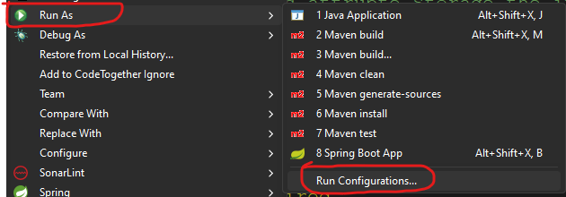
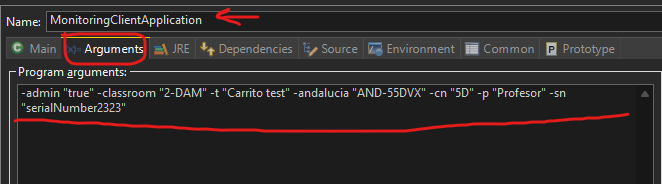

# MONITORING CLIENT: Cliente del proyecto de reaktor para conectarse al servidor con un ordenador

# Descripción del proyecto

Monitoring client o servidor cliente es una de las partes del proyecto de reaktor que se encarga de recoger información de los ordenadores conectados y mandarlas a la base de datos para posteriormente su uso en servidor

Está desarrollado en Java utilizando la tecnología de springboot para conectarse a una parte del servidor de reaktor que se encarga de mandar la información del ordenador que se ha conectado a una base de datos

# Arranque del proyecto

Para arrancar el proyecto es necesario lanzar el fichero de arranque del proyecto ubicado en ( dentro del proyecto )
```
.\Reaktor\MonitoringClient\src\main\java\es\iesjandula\reaktor\monitoring_client
```
Y al ejecutarlo tenemos que usar los siguientes argumentos:
<ul>
    <li>-admin "true" | "false" (opcional) indica si el usuario es o no administrador</li>
    <li>-classroom "valor" (obligatorio) indica la clase en la que se encuentra el ordenador</li>
    <li>-t "valor" (obligatorio) indica el carrito al que pertenece el ordenador</li>
    <li>-andalucia "valor" (obligatorio) número de andalucía del ordenador</li>
    <li>-cn "valor" (obligatorio) pegatina identificativa del ordenador</li>
    <li>-p "valor" (obligatorio) profesor que gestiona el ordenador</li>
    <li>-sn "valor" (obligatorio) número de serie del ordenador</li>
</ul>

Para arrancarlo se debe hacer desde el IDE Eclipse ya que se necesita un jar que ejecute todo el proyecto porque 
si ejecutamos desde cmd la clase MonitoringClientApplication.java solo ejecutará esa clase y no el resto de modulos
dando errores de compilación, por lo que dentro del IDE Eclipse buscamos el proyecto y cuando localicemos tenemos dos opciones

<ol>
    <li>Si es la primera vez que ejecutamos la clase seleccionamos run Java Application, en ese momento paramos la ejecución, en la rama de proyectos buscamos la clase, hacemos click derecho sobre ella y seleccionamos run as y buscamos run configurations, y allí tenemos que meter <b>todos</b> los parámetros</li>
    <br>
    <li>Si la hemos ejecutado más de una vez basta con buscar la clase en la rama de proyectos seleccionar run as buscar run configurations, comprobar que la clase está correcta e introducir los parámetros</li>
    <br>
</ol>

<b>Arranque de configuración</b>



<b>Parámetros y configuración de clase</b>



```
-admin "true" -classroom "2-DAM" -t "Carrito test" -andalucia "AND-55DVX" -cn "5D" -p "Profesor" -sn "SerialNumber123"
```

Todos los parámetros son <b>obligatorios</b> (excepto admin) si falta alguno el cliente no arranca

## Créditos

Este proyecto es una continuación del proyecto base Reaktor realizado por:

- [Alejandro Aljarilla Castro](https://github.com/Aljarilla11)
- [Neil Hernández Salvador](https://www.linkedin.com/in/neilhdez/)

Los alumnos de 2DAM se encargaron de desarrollar esta parte del proyecto supervisado por el profesor D.Francisco Benítez Chico.

- [Francisco Benítez Chico](https://www.linkedin.com/in/franciscobenitezchico/)