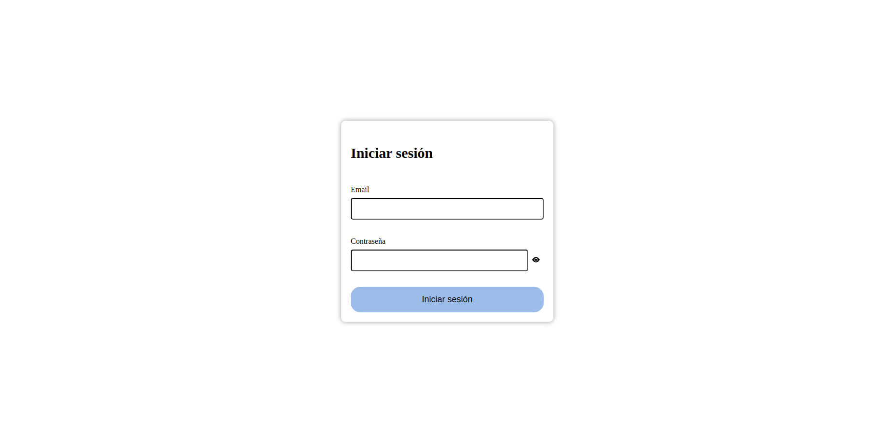
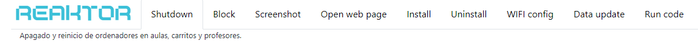
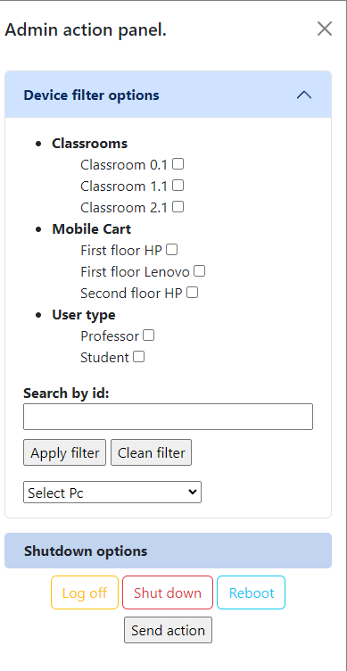
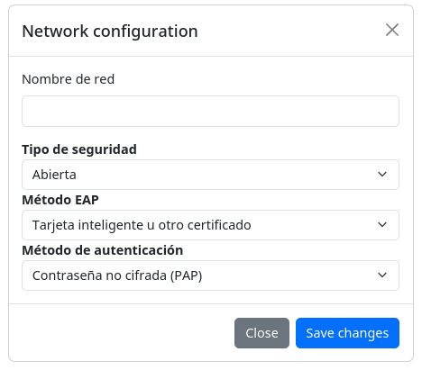

# Bienvenido al Repositorio del Equipo de Prototipado Front-end de REAKTOR

En este repositorio, presentamos la primera versión del innovador *portal de administración*, exclusivamente accesible para perfiles autorizados que utilicen la potente herramienta **REAKTOR**. Este panel, producto de la colaboración conjunta de los talentosos estudiantes de primero de *Desarrollo de Aplicaciones Multiplataforma (DAM)*, representa el resultado final de su dedicación y creatividad.

Descubre una interfaz cuidadosamente diseñada y desarrollada por estos jóvenes profesionales, quienes han fusionado sus conocimientos y habilidades para crear una experiencia de administración sencilla y rápida de comprender. Este proyecto es el testimonio de su compromiso destreza e ilusión por el mundo del desarrollo.

¡Explora con confianza el panel de administración de **REAKTOR**, diseñado por los chicos y chicas de primero de DAM de IE

## Organización del proyecto.
Para optimizar la ejecución del proyecto, se ha dividido en tres equipos, cada uno con asignaciones específicas. Esta estructura se ha implementado mediante la creación de ramas de desarrollo. La colaboración efectiva entre los equipos ha sido fundamental para alcanzar los resultados deseados de manera eficiente y coordinada.

### Área de Pruebas de Diseño
En esta área, el equipo de Panel de Acciones ha realizado las primeras pruebas de diseño, evaluando los conceptos iniciales de filtrado de dispositivos y la aplicación masiva de acciones. Estas pruebas constituyen un paso fundamental en la validación y refinamiento de las ideas propuestas, permitiendo asegurar la efectividad y coherencia de los enfoques implementados.
Adicionalmente, en esta rama de desarrollo alojó el trabajo en el diseño de la página de inicio del programa, la cual posteriormente fue integrada en la rama principal.

|Página de inicio|
|:-:|
||

### Barra de navegación y texto indicador.
a barra de navegación representa un componente fundamental en cualquier portal web, ya que proporciona elementos esenciales para que el usuario pueda desplazarse y buscar lo que necesita. En este proyecto, hemos decidido potenciar al máximo el concepto de navegación, otorgando al usuario la capacidad de localizar fácilmente todo lo necesario para sus operaciones administrativas. Además, hemos incorporado breves textos descriptivos que indican la acción seleccionada, con el objetivo de eliminar cualquier ambigüedad respecto a las acciones que están a punto de llevar a cabo.

|Barra de navegación|
|:-:|
||

### Área de Diseño del Panel de Acciones
Esta área constituye una parte integral del equipo de diseño encargado del panel de acciones. En este ámbito, se ha conceptualizado y desarrollado el panel de acciones lateral, junto con todas las funcionalidades relacionadas con el filtrado y la configuración masiva de equipos mediante modales.

El objetivo primordial, desde el inicio de este proyecto, ha sido optimizar la experiencia del usuario al simplificarla y reducir al mínimo necesario el esfuerzo requerido para ubicar las herramientas disponibles en el programa.

|Panel de acciones lateral|
|:-:|
||

### Rama de networking y conexiones.
En esta rama, se realizó el diseño e implementación de las opciones de configuración de red, siguiendo las directrices establecidas. El producto final es un modal simple y fácil de usar, destinado a la configuración masiva de equipos. Este modal no solo cumple con las expectativas delineadas, sino que también aporta un ahorro significativo de tiempo para los técnicos de mantenimiento y otros profesionales de TI.

|Modal de configuración de red|
|:-:|
||

